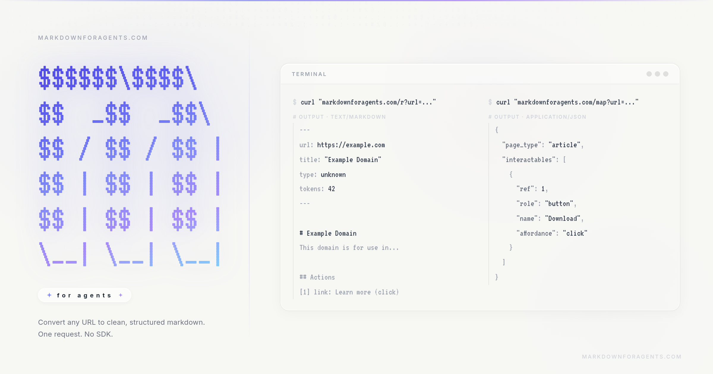

# Markdown for Agents



Convert any URL into agent-ready markdown or structured JSON.

- `GET /r?url=...` returns clean markdown with YAML frontmatter
- `GET /map?url=...` returns PageMap JSON (metadata, images, interactables, stats)
- Built for LLM and agent workflows: fast, deterministic, easy to parse

## Why this exists

Most web pages are noisy for AI systems. This project turns a page into:

- concise markdown content
- machine-readable metadata
- actionable UI elements (links/buttons/inputs)

So agents can read and act with less prompt bloat and fewer parsing hacks.

## Quick example

```bash
curl "https://markdownforagents.com/r?url=https://example.com"
```

```bash
curl "https://markdownforagents.com/map?url=https://example.com"
```

## API

### `GET /r?url={url}`

Returns `text/markdown` with frontmatter:

```md
---
url: https://example.com
title: Example Domain
type: article
tokens: 42
---

# Example Domain
```

### `GET /map?url={url}`

Returns structured JSON:

```json
{
  "url": "https://example.com",
  "title": "Example Domain",
  "page_type": "article",
  "content": "# Example Domain...",
  "interactables": [],
  "images": [],
  "metadata": {},
  "stats": {
    "tokenCount": 42,
    "conversionStrategy": "ai-tomarkdown",
    "sourceFormat": "text/html"
  }
}
```

### `GET /health`

Health check endpoint.

## Local development

Requirements:

- Bun 1.3+
- Node.js 20+

Install dependencies:

```bash
bun install
```

Run all apps in dev mode:

```bash
bun run dev
```

Or run just one app:

```bash
# API (Cloudflare Worker)
bun run --filter @markdownforagents/api dev

# Web (Nuxt)
bun run --filter markdownforagents-web dev
```

Run tests:

```bash
bun run test
```

## Monorepo layout

```text
apps/
  api/        # Hono + Cloudflare Worker API
  web/        # Nuxt website and demo UI
packages/
  pagemap/    # Shared extraction/enrichment logic
```

## Security notes

- SSRF protections block localhost/private ranges/metadata hosts
- URL scheme allowlist (`http`, `https`)
- response size limits and timeouts to reduce abuse

## Tech stack

- Cloudflare Workers
- Hono
- Workers AI (`AI.toMarkdown`)
- Nuxt 4
- Turborepo + Bun workspaces
- Vitest

## License

MIT. See `LICENSE`.
